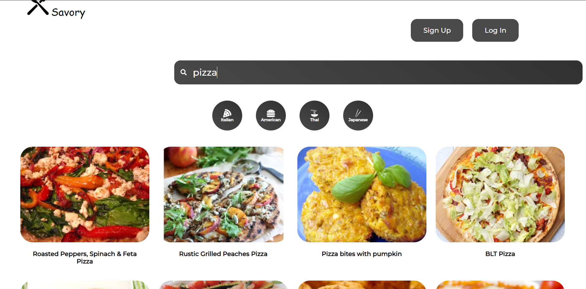

# React.js Recipe Book App

## Overview

This web application is a Recipe Book web app built with ReactJs. It allows users to explore a collection of recipes fetched from an external API.

## Features

- React.js component based architecture.
- Use of Spoonacular API via axios.
- Responsive design for an optimal viewing experience on different devices.


## Setting Up

### Prerequisites

Make sure you have Node.js and npm installed on your machine. Registration to Spoonacular API is also needed to use the external API.

### Installation

1. Clone the repository:

   ```bash
   git clone https://github.com/OzturkVedat/RecipeBookApp_ReactJs.git
   cd RecipeBookApp_ReactJs
   ```
2. Connect your API key:
   Use the API key provided from the Spoonacular website as an vite enviroment variable(for development purposes). Create an .env file in root folder and add the line:
   ```bash
   VITE_REACT_APP_API_KEY=your_api_key
   ```
4. Install dependencies and run the app:

   ```bash
   npm install
   npm run dev
   ```

5. Open the app in your browser at `http://localhost:5173/Recipe_Book_App/`.

## UI



